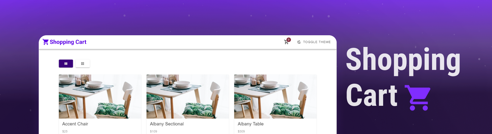
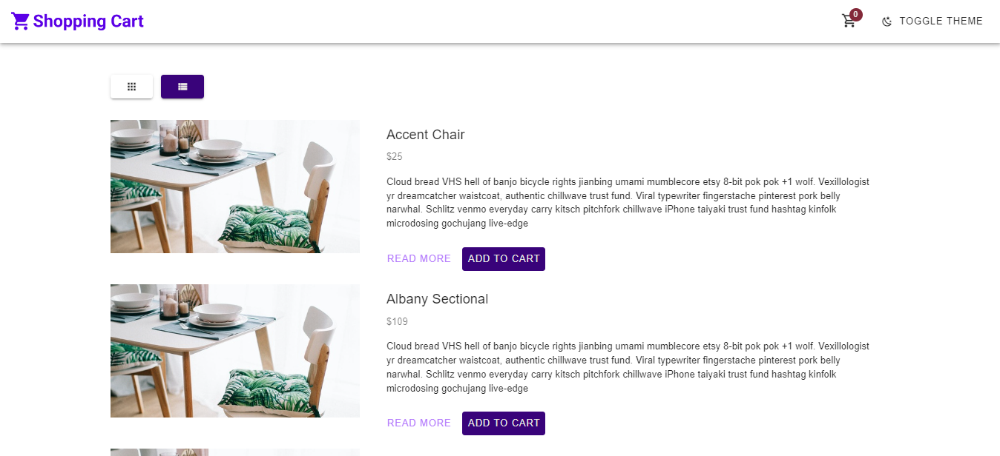
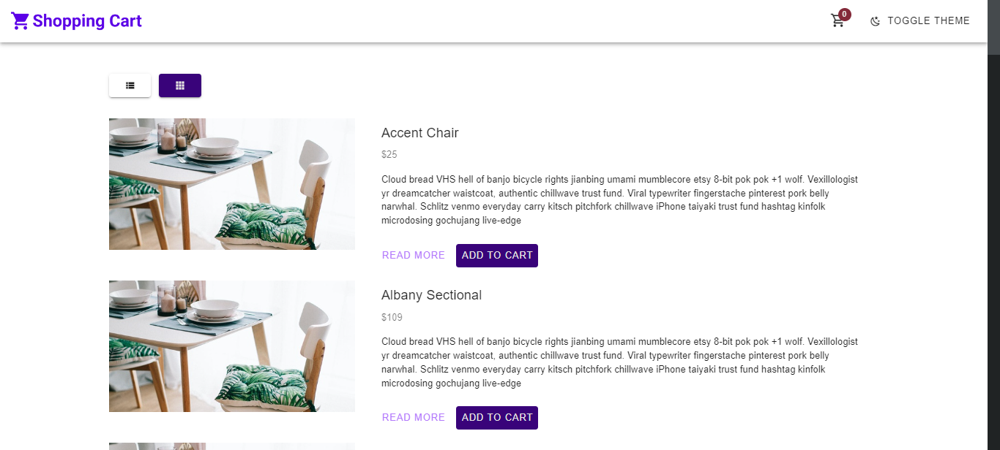
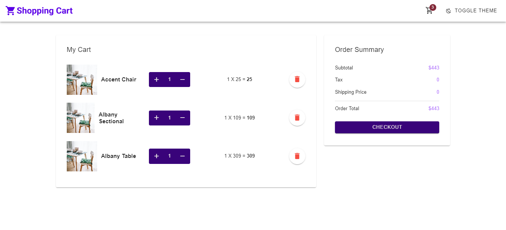

# Shopping Cart Application

Shopping Cart é uma aplicação NuxtJS 3 de carrinho de compras, tendo como aplicabilidade ser um gerenciador de carrinho de compras, suas funcionalidade são, listagem de produtos disponíveis para compras, adicionar uma quantidade específicas de itens no carrinho, aumentar ou remover a quantidade de itens no carrinho, exibir o total de itens no carrinho no Header, e em uma segunda página exibir itens e valores de checkout com total da soma dos itens no carrinho. Acesse [Play Books](https://nuxt-shopping-cart.netlify.app/).

Abordagens como padronização de projetos NuxtJS, VueJS 3, Typescript, Vuetify 3, Vue Store Pinia, Componetização, Vue Router.

## 🚀 Abordagens

- Typescript
- NuxtJS
- VueJS 3
- Vuetify 3
- Vue Store Pinia
- Componetização
- Vue Router

## 📌 Foi utilizado Frontend

#### Dependências de Projeto

- nuxt: 3.0.0

#### Dependências de Desenvolvimento

- @fortawesome/fontawesome-free: ^6.2.1,
- @mdi/font: ^7.0.96,
- @pinia/nuxt: ^0.4.6,
- sass: ^1.56.1,
- vuetify: ^3.0.2

## ▶️ Iniciando a aplicação

- Clone esse repositório
```
$ git clone https://github.com/alex-candido/nuxt-shopping-cart.git
```
- Instalar dependências 
```
$ yarn 
```
- Inicie o projeto 
```
$ yarn dev
```




